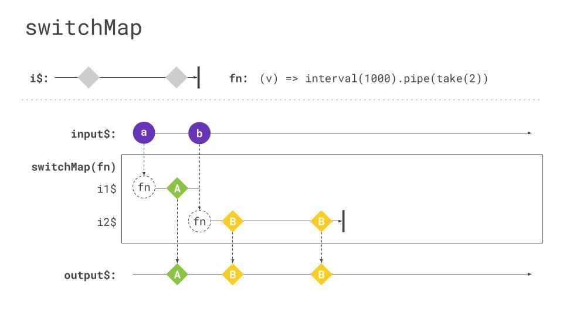
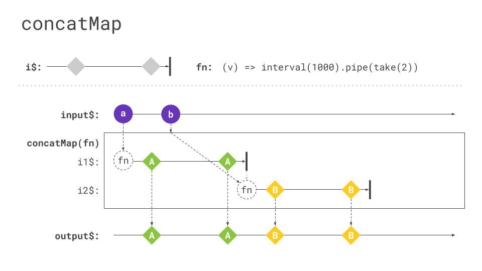
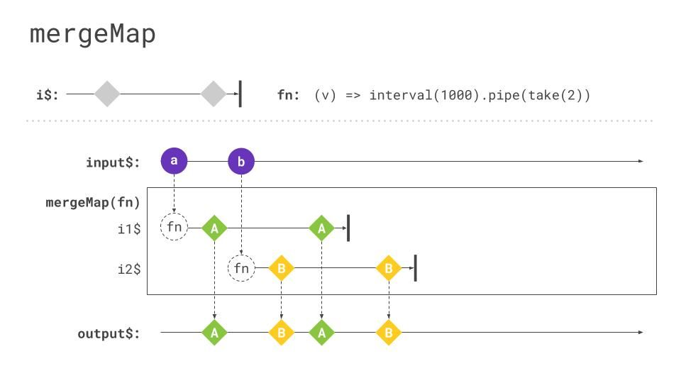

RxJS comes with more than 100 different operators. [SwitchMap](https://rxjs.dev/api/operators/switchMap) is probably the one that is discussed the most often. It's a very powerful operator, being very useful in many situations, but it's also quite a dangerous one. In this blog article, we will talk about `switchMap` and also covers the issues it might introduce to your application. Additionally, we will cover the operators having a similar use case. This will make it easier for you, the next time you need to pick one of those.

Before we start talking about the dos and don'ts of using `switchMap`, let's first summarize the way `switchMap` is working. SwitchMap is a so-called higher-order operator. Maybe you are already familiar with the concept of higher-order functions because it's quite similar.
In case you aren't, A higher-order function is a function returning another function or accepting a function as a parameter. Think about the Array method `map`. It takes a function as a parameter which is used to define the transformation of every single item within the array.

A higher-order operator is handling an Observable of Observables. `SwitchMap` particularly is returning the notifications of an inner Observable.

```ts
of('hello world').pipe(
  switchMap(value => {
    return ajax.getJSON('http://my.api.com?search=' + value);
  }),
);
```

This code example will be used to explain `switchMap` roughly. We will extend it later on, to take a deeper look at it.

But first things first. `SwitchMap` takes the values from the outer observable (returned by the [of](https://rxjs.dev/api/index/function/of) operator) and pass those as a parameter to a function which has to return a new observable. In this particular case, we are using the ajax module of RxJS (for reference you can find some information [here](https://rxjs.dev/api/ajax/ajax)). Here we are using the `getJSON` method to perform a get request and return its response as a new observable.

Technically, we are subscribing to the newly returned observable and passing its value to the next operator in the chain or as usual to the next handler in the subscribe method.

Now you are familiar with the basics of `switchMap`, we will take a deeper look at it. Don't worry if it may take a while to fully understand `switchMap` in detail. But if you got it, you will notice, that `concatMap`, `mergeMap`, and `exhaustMap` are quite similar. But first, let's dive deep into `switchMap`. As promised I extended the
example above and to make it more explorable I created a [Blitz](https://stackblitz.com/edit/rxjs-about-switchmap?file=index.ts) for it.
In the `index.ts`, you will stumble across the following piece of code.

```ts
const httpCall$ = ajax.getJSON('https://rickandmortyapi.com/api/character/');
const click$ = fromEvent(document, 'click');

const switchMapExample$ = click$.pipe(
  tap(() => console.log('inside switchMap - click happend')),
  switchMap(() => {
    console.log('inside switchMap - start http request');
    return httpCall$.pipe(tap(val => console.log('inside switchMap - http response ', val)));
  }),
);
```

Instead of passing one single value to the switchMap function we are now calling switchMap every click (for reference take a look at [fromEvent](https://rxjs.dev/api/index/function/fromEvent)). The `fromEvent` is used as an example for any kind of input stream. It could also be any other `Observable` you'd like to.
So as soon as you click somewhere on the page it will immediately log `inside switchMap - click happened` to the console. Afterwards, `switchMap`is called. This will also log `inside switchMap - start http request` immediately. At the end of the function passed to `switchMap`, we are returning an `httpCall$` Observable. This will perform an HTTP request as soon as someone subscribes to it. Additionally, we are using [tap](https://rxjs.dev/api/operators/tap) again to log the value of the HTTP response.
<>
I already mentioned above, `switchMap` is passing the value of a source `Observable` and pass this to a function that needs to return a new `Observable`. `SwitchMap` will take care of subscribing to that returned Observable. But now there are two edge cases.

1. What happens if the `Observable` returned inside `switchMap` is a long-living `Observable` which emits multiple items.
2. What happens if my source Observable emits faster than the one returned inside `switchMap`

Both of these problems are visualized in the following marble diagram.
If you are not familiar with the marble diagram syntax, take a look at the [Marble Diagram Section](https://rxjs.dev/guide/operators).

Please notice that all the following marble diagrams are kindly provided by [Michael Hladky](https://twitter.com/Michael_Hladky).



Let's go through these problems one by one. In case we returned a long-living `Observable` inside our `switchMap` function, we will see in the marble diagram, that all notifications are outputted. A very common example for a long-living `Observable` would be HTTP polling, where we request an API every X seconds and return its response. All those responses would be passed to the next operator in the `Observable` chain. As you can see in the `i2$` Observable, both notifications are passed to the `output$` Observable. Now that we know how `switchMap` handles long-living `Observables`, the second edge case arises. What happens, when the source `Observable` emits faster than the newly created `Observable`.
`SwitchMap` interrupts the `Observable` execution as soon as there is a new value coming from the source `Observable`. If you double-check this with the marble diagram, you will notice that the stream `i1$` immediately ends as soon as notification `b` is coming. Additionally, it will trigger the new Observable `i2$` and subscribes to that one.
We already said, that `switchMap` automatically subscribes to the inner `Observable`. Additionally, it automatically unsubscribes from it, as soon as there is a new value coming from the source `Observable`. This means that `switchMap` also includes a build-in subscription-management mechanism.

You can experience this operator in the linked Stackblitz example. It will trigger an HTTP call after you clicked somewhere. If you click fast enough you will notice that some of the HTTP calls are canceled. You can see that in the network view of the Chrome DevTools. If one of the requests is labeled with `canceled`, this means, that the Observable, that executed the HTTP call, is unsubscribed from.

Now that we know about `switchMap`, I'd suggest, let's take a look at the other operators.

## Comparing to similars

So now it's time to keep my promise. I already mentioned `switchMap` is very similar to `concatMap`, `mergeMap` & `exhaustMap`. So what's the difference?

### ConcatMap

Let's start with [concatMap](https://rxjs.dev/api/operators/concatMap). `ConcatMap` also passes notifications of a source observable to an inner observable. It subscribes to that and waits till it completes before it uses the next notification emitted by the source `observable`. So potentially one could run into memory leaks if the source observable emits endlessly and faster than the inner observable can complete. `ConcatMap` taking care of the order the inner observables were instantiated. Therefore it is the safest operator of those we cover in this article, from a business perspective. Theoretically you could run into the technical problem of having memory leaks, but still, if you are unsure which operator to choose, I'd recommend taking `concatMap`. You'll be fine, more or less. So if you are performing HTTP requests inside the `concatMap` function, you can be sure that one receives the response of the responses before the next notification of the source observable is passed to the inner observable. In the meantime, it buffers those notifications to be ready as soon as the inner observable completes.

Maybe the following marble diagram sums up the behavior of `concatMap` quite well. Instead of interrupting `i1$` as it used to with `switchMap`, it waits for the completion of `i1$` and buffers the notifications in between, like `b`. After the first stream completes it will start working on the buffered notifications.



You can also explore the behavior of `concatMap` in the Stackblitz I linked above. You need to copy everything from the `operators/concatMap.ts` file over to `index.ts`. The code is pretty much the same as before, just instead that it is now using `concatMap`. What you will notice if you click furiously somewhere in the window, is that it will make HTTP calls for each click you made, but just one by one. And even more important, it waits for every HTTP call to complete before instantiating the next one.

### MergeMap

[MergeMap](https://rxjs.dev/api/operators/mergeMap) or `flatMap` (which is just an alias of `mergeMap`) is quite similar to `concatMap`, although it doesn't consider the order and it doesn't wait for the completion of one inner observable before subscribing to the next one. If we stick to the HTTP example, theoretically one could run into the situation where multiple HTTP requests are initiated inside the mergeMap function, if it doesn't wait for its completion, one could receive the response of the 2nd instantiated before the first one emits its response.

The following diagram displays the behavior quite well. Notifications of stream `i2$` can be passed to the `output$` stream, even though `i1$` didn't completed yet.



Again you can try out the behavior of `mergeMap` in the linked Stackblitz.

Do note, that `mergeMap` is definitely the wrong operator if the order of the notifications is important for you. If you need to process notifications sequentially, use `concatMap`!

### ExhaustMap

Last but not least, [exhaustMap](https://rxjs.dev/api/operators/exhaustMap). which is quite the opposite of `switchMap`. While switchMap is unsubscribing from the inner observable as soon as there is an incoming notification from the source observable, exhaustMap ignores those notifications completely, until the inner observable completes. This operator is the perfect match if you fear nervously clicking users crashing your application. But be aware that notifications in between aren't buffered, they are completely ignored. This behavior makes it different from `concatMap`, which will buffer those notifications.

The following marble diagram demonstrates this very well. Notification 'b' is completely ignored! It waits until `i1$` completes. Afterwards, it will be triggered by the next notification from the source observable, which is `c` in the marble diagram below.


And again, you can play around with the behavior of `exhaustMap` in the linked Stackblitz. If you will do things like double and triple clicks, you will notice, that those are ignored as long as the HTTP request is ongoing. Afterwards, you can click again to retrigger an HTTP call.

## The risks of using switchMap

Now that we know about all those fantastic operators, many of you might already have heard, that there might be some issues using `switchMap`. Let's figure out what this rumor is all about.

The problem with `switchMap` is that even though it cancels HTTP requests from a client perspective, the backend anyway "receives" those requests and may perform some actions. The problem with that is, that the backend anyway handles the requests and might perform mutation on the objects. This would result in having a different state on the client side than in the backend. For example, you are performing an account transaction in combination with `switchMap`. If you are initiating this multiple times, for the client it looks like it just happened once, but the backend receives multiple requests which leads to multiple transactions. And for sure no one wants to transfer money multiple times :D As long as you don't perform any mutation on the object instance on the server side or trigger any additional actions, you are good to go with `switchMap`. Fetching an object or polling objects is a totally valid use case for `switchMap`, but be aware of server-side actions or mutations!

## Wrap up

- switchMap subscribes to the inner Observable with every new notification
- it automatically unsubscribes from an old inner Observable
- Be cautious when using switchMap
- Use concatMap when you are unsure
  - consider memory leaks of long-living Observables
- use switchMap for fetching/polling/ read-only transactions
- be aware of server-side mutations or actions performed

## Special Thanks

Many thanks to everyone, who helped me writing this blog article.
Thanks to [Todd Motto](https://twitter.com/toddmotto), [Wes Grimes](https://twitter.com/wesgrimes) and [Brian Troncone](https://twitter.com/BTroncone) for reviewing the article and providing very valuable feedback. Additionally, I want to thank [Michael Hladky](https://twitter.com/Michael_Hladky) for providing those marvelous marble diagrams!
