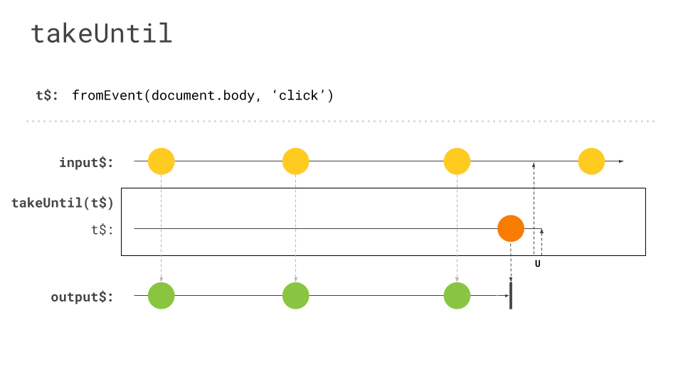
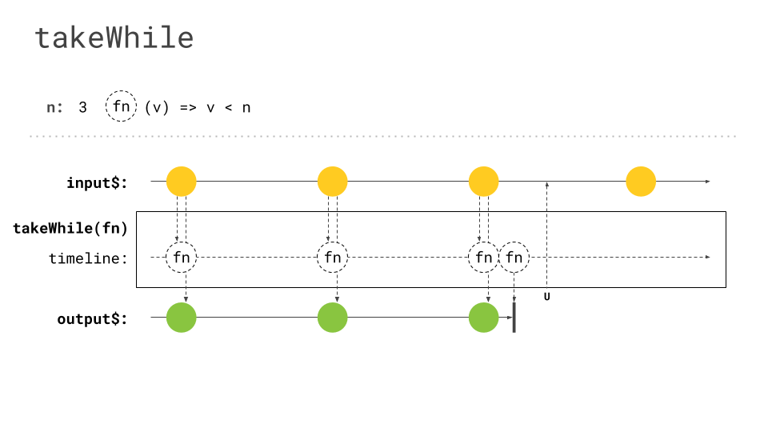

It might be know to you already, that there are situations where you actually want to unsubscribe from your `Observables`.
There are several ways to do this. In several projects, I stumbled across a mixture of using [`takeWhile`](https://rxjs.dev/api/operators/takeWhile) & [`takeUntil`](https://rxjs.dev/api/operators/takeUntil). This raises the question, why are there two of that, which sounds similar and act similarly?

## About takeWhile

Well, let's take a look at a quick example. The first code snippet we are looking at is using `takeWhile` to unsubscribe from an `Observable`.



In this example I have two different `Observables`. The first is created using the [interval operator](https://rxjs.dev/api/index/function/interval). This will emit notifications till the condition passed to `takeWhile` is falsy. Inside the `takeWhile` we use a boolean variable describing if the user has already clicked or not. As soon has one clicks somewhere in the screen, we unsubscribe from our `interval`-Observable. To determine if the user already clicked we used a second `Observable` created with the [fromEvent operator](https://rxjs.dev/api/index/function/fromEvent). Additionally we used the [tap operator](https://rxjs.dev/api/operators/tap), to log the notifications in the console. We can see that our Observable is unsubscribed as soon as there is no new log coming in.

## About takeUntil



From a high-level perspective, the code snippets don't look that different. Instead of having a boolean property, describing the state of our `Observable`, we now directly used the `click`-Observable.
We pass this `Observable` instance to the `takeUntil` operator and as soon as the user clicks somewhere, our `interval`-Observable will be unsubscribed from.

## The Problem

So all in all both code snippets look similar and behave similar, right? Well, No!
Let's have a look at the marble diagrams describing those operators because this will highlight the difference between those two operators.


_takeUntil marble diagram, kindly provided by [Michael Hladky](https://twitter.com/Michael_Hladky)_


_takeWhile marble diagram, kindly provided by [Michael Hladky](https://twitter.com/Michael_Hladky)_

The problem here is that `takeWhile` is intended to take an incoming notification and check a specified condition on it, which might lead to an unsubscribe. The important fact is, that `takeWhile` is triggered by the incoming notification and might unsubscribe afterwards. In contrast `takeUntil` is triggered by the passed `Observable`.
That's why `takeWhile` might cause several issues. So definitely, it needs a new notification to unsubscribe. Imagine having a long-living `Observable`. You will need one notification more with `takeWhile` than with `takeUntil`. Also, this additional notification can initiate multiple processes within your `Observable`. Imagine having code like this:

```ts
longLivingObservable$
  .pipe(
    tap(() => this.startAnimation()),
    switchMap(val => this.makeHttpCall(val)),
    takeWhile(val => this.alive),
  )
  .subscribe();
```

So what's the issue with this piece of code? Well, our component is already destroyed and due to the needed notification, needed before unsubscribing kicks in, we will start an animation and trigger an HTTP call. This is probably unwanted and just afterwards we will check if we want to unsubscribe from our `Observable`. Besides the fact that those operations are totally superfluous, it also might break our app or pollute our state.

Additionally, if our `Observable` doesn't emit an additional value, the `takeWhile` will never be triggered and therefore our `Observable` will never be unsubscribed. This can be considered as memory-leak, because our `Observable` stays subscribed.

_Now maybe one might argue: "Well, I could move the `takeWhile` operator at the very beginning of the observable pipeline!"_

That's true, you could do this, and you will save the unneeded operations, which is a good start, but you won't unsubscribe from inner observables. So if the `Observable` returned by `makeHttpCall` is a long-living `Observable`, it will not unsubscribe from that, if the `takeWhile` is before `switchMap` in the pipe. By the way, the same goes for `takeUntil`, so make sure to have the unsubscribe-operator at the very end of your pipe.

## The Solution

Don't get me wrong, `takeWhile` is an amazing operator, but just if you actually use the incoming value to determine, whether you want to unsubscribe or not! Do not depend on "global" state, when using `takeWhile`.
For those scenarios stick to `takeUntil` and use a Subject instance to trigger it.

A real-world use case for `takeWhile` would be a long-polling mechanism. Imagine fetching a resource describing a process. This process can be successfully completed or otherwise ongoing. For sure you just want to continue polling while the process isn't completed yet. The code for such a scenario could look like this.

```ts
longPolling$.pipe(takeWhile(process => process.completed)).subscribe(() => handleNotCompleted());
```

For such a scenario, where we use the incoming will, to determine wether we want to stay subscribed or not, `takeWhile` is ideal! If we have an external trigger, stick with `takeUntil`.

## Wrap Up

- use takeWhile when the incoming value make you want to unsubscribe
- use takeUntil when there is an outer event determine that you want to unsubscribe
- use both of them as the last operator in your `Observable` pipeline
  - [There's a tslint rule for that](https://github.com/cartant/rxjs-tslint-rules)
